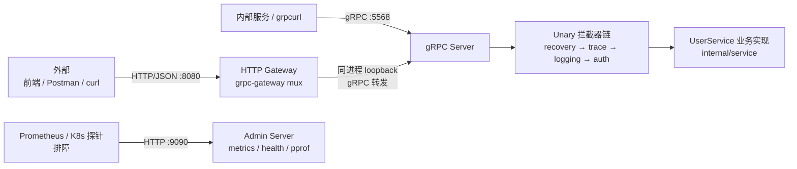

# Aura · 仓库入口 (L0)

原生 grpc-go 服务，**同进程**内同时暴露两个入口：

- **gRPC `:5568`** — 内部服务间高性能调用。
- **HTTP REST `:8080`** — 外部第三方 / 前端 / Postman 调用。

核心方案 [grpc-gateway](https://github.com/grpc-ecosystem/grpc-gateway)：在 `proto/` 里用 `google.api.http` annotation 声明 HTTP↔gRPC 路由映射，自动生成反向代理层，把 HTTP/JSON 请求翻译成 gRPC 调用。**业务逻辑只写一份**（`internal/service`），两个入口共用。

> **文档体系**：分层 `AGENTS.md`（手动按需下钻）。每个事实只在最贴近代码的一层声明，上层只放一句话摘要 + 链接到下层（DRY）。

## 架构



**核心契约**：

- **一份业务两入口**：`internal/service` 实现 `userv1.UserServiceServer`，gRPC 直接注册、HTTP 经 gateway loopback 转发，逻辑零重复。Handler 返回的对象统一是深拷贝（`proto.Clone`），调用方拿到的指针不会被并发 Update 改写。
- **鉴权只写一遍**：HTTP 的 `Authorization` header 经 gateway 转发时自动透传成 gRPC metadata，因此 `UnaryAuthInterceptor`（JWT 校验）同时覆盖两个入口。
- **拦截器链顺序**（gRPC，外→内）：`recovery → trace → logging → auth → handler`。`trace` 必须在 `logging` 之前，访问日志才能带上 `trace_id`。HTTP 端中间件链：`otelhttp → X-Trace-Id 响应头 → CORS → 访问日志 → mux`。
- **失败兜底不泄露细节**：`recovery` 把 panic 内容仅写日志，对外只回固定 `codes.Internal`；CORS 策略来自 `config.Server.CORS`，并在启动期拒绝 `allow_credentials=true && origins=["*"]` 的不合规组合。
- **链路贯通**：HTTP 入口与 loopback gRPC 调用通过 W3C `traceparent` 落在同一条 trace 上（otelhttp + otelgrpc），`trace_id` 自动注入日志字段。
- **可观测性三支柱**：日志（`pkg/log`）+ 链路（`pkg/otel` tracing，可选 OTLP 上报）+ 指标（`pkg/otel` metrics，Prometheus）。`/metrics`、`/healthz`、`/readyz`、`/debug/pprof` 统一挂在**独立运维端口 `:9090`**（`internal/admin`），与业务端口隔离；gRPC 侧另注册标准健康检查服务。otelgrpc/otelhttp 自动产出 RED 指标，业务零埋点。
- **配置热更**：`config.Get()` 永远拿最新快照；日志级别等【热更生效】字段改 yaml 立即生效，端口 / JWT / 可观测性等【需重启】字段需重启。`Init` 在进程内幂等，`Stop` 之后即便仍有定时器派发也不会改写配置。

## 技术栈

| 类别 | 选型 |
|------|------|
| 语言 | Go 1.26（`module aura`，纯 Go / `CGO_ENABLED=0`） |
| RPC | [grpc-go](https://google.golang.org/grpc) + [grpc-gateway v2](https://github.com/grpc-ecosystem/grpc-gateway)（HTTP↔gRPC 反向代理） |
| 协议 | Protocol Buffers + `google.api.http` annotation |
| 拦截器 | [go-grpc-middleware/v2](https://github.com/grpc-ecosystem/go-grpc-middleware)（recovery / logging / auth / selector） |
| HTTP 中间件 | [rs/cors](https://github.com/rs/cors)（CORS）+ [gorilla/handlers](https://github.com/gorilla/handlers)（访问日志） |
| 鉴权 | JWT（[golang-jwt/jwt v5](https://github.com/golang-jwt/jwt)，HS256） |
| 日志 | [zap](https://github.com/uber-go/zap)（封装见 `pkg/log`，含 context 链路字段） |
| 链路追踪 | [OpenTelemetry](https://opentelemetry.io)（otelgrpc / otelhttp + W3C TraceContext，可选 OTLP 上报，封装见 `pkg/otel`） |
| 指标 | OpenTelemetry Metrics + [Prometheus](https://prometheus.io) 拉取式 exporter + Go runtime 指标（封装见 `pkg/otel`，端点见 `internal/admin`） |
| 健康检查 / 剖析 | gRPC `grpc.health.v1.Health` + HTTP `/healthz` `/readyz` + `net/http/pprof`（统一挂 `internal/admin` 运维端口） |
| 配置 | YAML（[yaml.v3](https://gopkg.in/yaml.v3)）+ [fsnotify](https://github.com/fsnotify/fsnotify) 热更（封装见 `config/`） |

## 顶层目录速查

| 路径 | 作用 | 下钻入口 |
|------|------|---------|
| `cmd/server/main.go` | 程序入口：装配配置 / 日志 / 链路 / JWT，同进程起 gRPC + HTTP 两个 server + 优雅关闭 | 直接读源码（约 200 行，已详注） |
| [`proto/`](proto/AGENTS.md) | Protobuf 协议定义 + HTTP 路由映射（**改接口的源头**） | L2 |
| [`internal/`](internal/AGENTS.md) | 业务实现：`service/`（gRPC handler）+ `interceptor/`（拦截器 + HTTP 中间件）+ `admin/`（运维/可观测性端点） | L2 |
| [`pkg/`](pkg/AGENTS.md) | 框架无关可复用组件：`jwt/` / `log/` / `otel/` | L2 |
| [`config/`](config/AGENTS.md) | 配置加载、多环境解析、热更新 | L2 |
| `gen/proto/` | `protoc` 生成产物（`*.pb.go` / `*_grpc.pb.go` / `*.pb.gw.go`），**勿手改**，运行 `make proto` 重生成 | — |
| `scripts/generate.sh` | 一键生成 pb 三件套（被 `make proto` 调用） | 直接读 |
| `config/app.yaml.example` | 配置模板，复制为 `config/app.yaml` 后填值 | — |

## 启动方式

```bash
make install-tools   # 首次：安装 protoc-gen-go / -go-grpc / -grpc-gateway 插件
make proto           # 改完 proto/user.proto 后重新生成 gen/proto 代码
make dev             # go run 直接跑（监听 :5568 gRPC + :8080 HTTP）
make build           # 完整流水线：clean + tidy + fumpt + lint + 编译到 bin/
make test            # 运行全部单测
```

看到 `🚀 gRPC server listening on :5568` 与 `🚀 HTTP gateway listening on :8080`、`🚀 admin server listening on :9090` 即启动成功。接口自测命令见 [`README.md`](README.md)。可观测性端点：`curl localhost:9090/metrics`（指标）、`curl localhost:9090/healthz`（存活）、`curl localhost:9090/readyz`（就绪）。

## 配置体系

- **配置文件**：`config/app.{APP_ENV}.yaml`，由 `APP_ENV` 选择（默认 `dev`），不存在时回退 `config/app.yaml`。
- **环境变量展开**：yaml 内支持 `${JWT_SECRET}` 语法，加载时由 `os.ExpandEnv` 展开，适配 CI/CD 与容器部署。
- **热更**：改 yaml 自动热更（fsnotify + 200ms 防抖），`config.Get()` 永远拿最新值；字段的【需重启】/【热更生效】语义见 [`config/types.go`](config/types.go) 注释。
- **环境变量**：仅 `APP_ENV` 用于切换环境标识，其余配置都走 yaml。

## 常见入口

| 想做什么 | 改哪里 |
|---------|-------|
| 加一个 RPC / 改请求响应字段 | [`proto/AGENTS.md`](proto/AGENTS.md) → 改 `user.proto` → `make proto` → 在 `internal/service` 实现 |
| 改某个接口的业务逻辑 | [`internal/AGENTS.md`](internal/AGENTS.md) → `service/user.go` |
| 加 / 改拦截器或 HTTP 中间件 | [`internal/AGENTS.md`](internal/AGENTS.md) → `interceptor/` + 在 `cmd/server/main.go` 挂链 |
| 调鉴权规则 / 免鉴权白名单 | [`internal/AGENTS.md`](internal/AGENTS.md) → `interceptor/auth.go` 的 `authWhitelist` |
| 复用 JWT / 日志 / 链路能力 | [`pkg/AGENTS.md`](pkg/AGENTS.md) |
| 加配置项 | [`config/AGENTS.md`](config/AGENTS.md) → `types.go` 加字段 + 默认值 + 更新 `app.yaml.example` |
| 开关指标 / 链路上报 / pprof | 改 `config` 的 `observability` 段（`metrics` / `tracing.exporter=otlp` / `pprof.enabled`） |
| 加自定义业务指标 | [`pkg/AGENTS.md`](pkg/AGENTS.md) → 用全局 `MeterProvider` 建 counter/histogram，自动并入 `/metrics` |
| 接真实 DB / Redis（替换内存实现） | `config` 已留好 `Database` / `Redis` 配置段；在 `internal/service` 注入依赖替换内存 map |

## 维护守则（写文档的人请看）

1. **DRY**：新事实只写在最贴近代码的那一层；上层只放一句话摘要 + 链接。
2. **Size**：L0 ≤ 3KB，L2 ≤ 8KB；超出说明该层职责过大，应再下钻。
3. **新增模块**：把模块的一行职责加到本文「顶层目录速查」表 + 创建该模块的 L2 `AGENTS.md`。
4. **代码细节别复制进文档**：字段 / 函数签名直接读源码（已详注），文档只讲「为什么 / 怎么协作 / 去哪改」。
